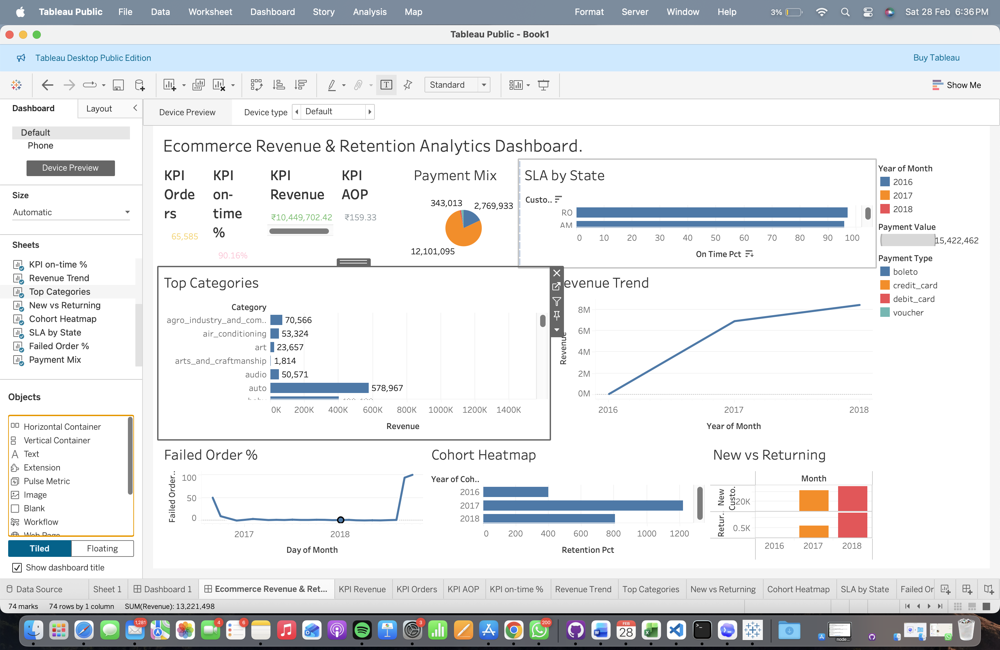
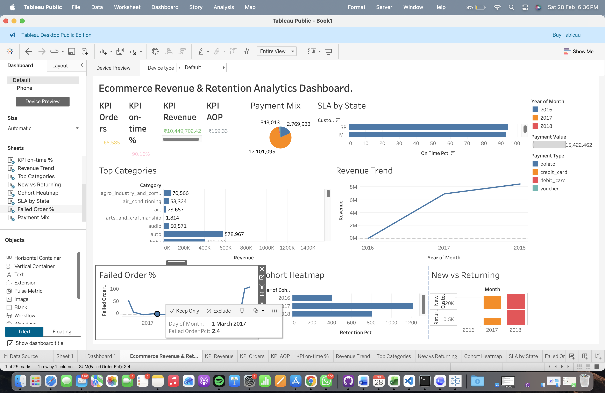
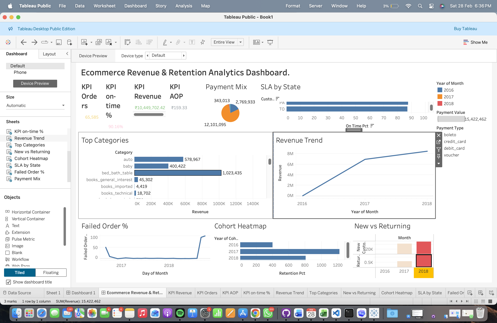

# Ecommerce Revenue & Retention Analytics (Olist)

End-to-end analytics portfolio project built using Python, PostgreSQL, SQL, and Tableau.

## Live Dashboard

- Tableau Public: [Ecommerce Revenue Retention Analytics Dashboard](https://public.tableau.com/app/profile/krishna.attal/viz/UsethisnameEcommerce_Revenue_Retention_Analytics_KrishnaAttal_twbx/EcommerceRevenueRetentionAnalyticsDashboard_?publish=yes)
- GitHub Repository: [ecommerce-analytics-project](https://github.com/Krishnaattal710/ecommerce-analytics-project)
- Project path in repo: `ecommerce-revenue-retention-analytics/`
- Workbook: `Ecommerce_Revenue_Retention_Analytics_KrishnaAttal.twbx`

## Problem Statement

Build a decision-ready analytics layer from raw ecommerce data to answer:
- How are revenue and orders trending over time?
- What is customer retention behavior?
- Which operational issues are affecting fulfillment quality?

## Tech Stack

- Python (ETL/load)
- PostgreSQL (data warehouse)
- SQL (analytics views + materialized tables)
- Tableau (dashboarding)

## Data Source

- Olist Brazilian Ecommerce public dataset (Kaggle + Olist public repo mirror)

## Project Structure

```text
.
├── dashboards/
│   ├── dashboard_layout.md
│   └── exports/
├── data/
│   └── raw/
├── docs/
│   └── insights_template.md
├── images/
│   ├── dashboard-overview.png
│   ├── dashboard-customer-retention.png
│   └── dashboard-operations.png
├── scripts/
│   ├── load_olist.py
│   └── validate_data.py
└── sql/
    ├── analytics_query_pack.sql
    └── materialize_analytics_tables.sql
```

## Pipeline

1. Load raw CSV files into PostgreSQL tables using `scripts/load_olist.py`.
2. Create analytics views from `sql/analytics_query_pack.sql`.
3. Materialize dashboard tables from `sql/materialize_analytics_tables.sql`.
4. Validate row counts and key objects with `scripts/validate_data.py`.
5. Build Tableau dashboard from analytics tables.

## Key Metrics Snapshot

- Delivered Orders: **65,585**
- Gross Revenue: **10,449,702.42**
- Average Order Value (AOV): **159.33**
- Average Review Score: **4.12**
- On-time Delivery: **90.16%**
- Average Delivery Duration: **12.67 days**

## Key Insights

1. The 12-month KPI window indicates strong transaction scale with 65K+ delivered orders and 10.45M revenue.
2. AOV at 159.33 provides a clear benchmark for upsell and basket growth initiatives.
3. Review score of 4.12 suggests generally positive customer experience despite operational variance.
4. On-time delivery at 90.16% is strong, but delay reduction remains a high-impact lever.
5. State-level SLA variance highlights specific geographies for targeted logistics improvement.

## Recommendations

1. Improve low-performing states using carrier-level SLA targets and weekly monitoring.
2. Increase repeat purchases via month 1-2 lifecycle campaigns for new cohorts.
3. Focus campaign spend on top-performing categories while protecting AOV through bundle and shipping-threshold tactics.

## Dashboard Screenshots

### Overview



### Customer & Retention



### Operations



## SQL Objects for BI

### Views

- `analytics.vw_order_fact`
- `analytics.vw_order_category`
- `analytics.vw_kpi_snapshot_12m`
- `analytics.vw_monthly_revenue_orders`
- `analytics.vw_customer_repeat_rate`
- `analytics.vw_new_vs_returning_monthly`
- `analytics.vw_sla_state`
- `analytics.vw_top_categories`
- `analytics.vw_payment_mix`
- `analytics.vw_failed_order_trend`
- `analytics.vw_cohort_retention_0_6`

### Materialized Tables

- `analytics.fact_order`
- `analytics.bridge_order_category`
- `analytics.kpi_snapshot_12m`
- `analytics.monthly_revenue_orders`
- `analytics.customer_repeat_rate`
- `analytics.new_vs_returning_monthly`
- `analytics.sla_state`
- `analytics.top_categories`
- `analytics.payment_mix`
- `analytics.failed_order_trend`
- `analytics.cohort_retention_0_6`

## Run Commands

```bash
# 1) load raw data
python scripts/load_olist.py --data-dir data/raw --strict

# 2) create analytics views
psql -d olist_analytics -f sql/analytics_query_pack.sql

# 3) create physical analytics tables
psql -d olist_analytics -f sql/materialize_analytics_tables.sql

# 4) validate
DATABASE_URL=postgresql+psycopg2://localhost/olist_analytics python scripts/validate_data.py
```

## Resume Bullets

- Built an end-to-end ecommerce analytics solution using Python, PostgreSQL, SQL, and Tableau on 100K+ order-level records.
- Designed reusable analytics views and materialized tables for revenue, retention, SLA, and category-performance reporting.
- Published an interactive executive dashboard with actionable customer and operations insights.
